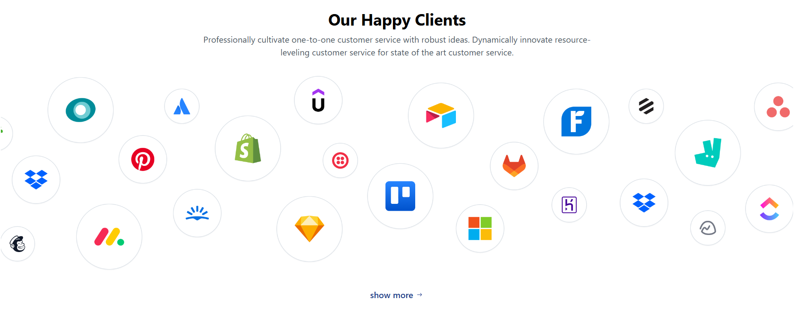

# Landing page using figma

This project features a responsive website UI, built with **React.js** and styled using **Tailwind CSS** for a modern and adaptable design."

## Features

**Interactive Components**: Dynamic UI elements created using React for smooth user interactions.

**Cross-Browser Compatibility**: Ensures that the design works seamlessly across all modern browsers.

**Fast Loading**: Optimized for speed using efficient build processes and code splitting.

**Customizable Layouts**: Flexible and reusable components designed to fit a variety of use cases.

## Tech stack

**React.js**: A powerful JavaScript library for building dynamic, interactive user interfaces with reusable components.

**Tailwind CSS**: A utility-first CSS framework for creating highly customizable, responsive, and visually appealing layouts.

**JavaScript**: The core scripting language that powers the interactivity and logic of the application.

**Vite**: A fast and modern build tool for development, offering quick start-up times and hot module replacement for an optimized workflow.

**React Router**: Efficient routing library to handle dynamic navigation between pages without reloading the page.

**ESLint**: A tool to ensure code quality by identifying potential errors and enforcing consistent code style across the project.

## Installation : Clone the Repositpry -

1. Navigate into the project directory:
   ```bash
   cd Assingment
   ```
2. Install dependencies:
   ```bash
   npm install
   ```

3. Start the development server:
   ```bash
   npm run dev
   ```

## How to Use

- Clone the repository and run the application as per the installation steps.

## Screenshots





- **Live Demo link** - https://vercel.com/souravanand-16s-projects/assingment-7kd4


- **Backup Demo link** - https://assingment-roan.vercel.app/


## Credits

This project was built as part of an assignment for **RegisterKaro**. Thanks to:
- [React.js](https://reactjs.org/)
- [Tailwind CSS](https://tailwindcss.com/)

